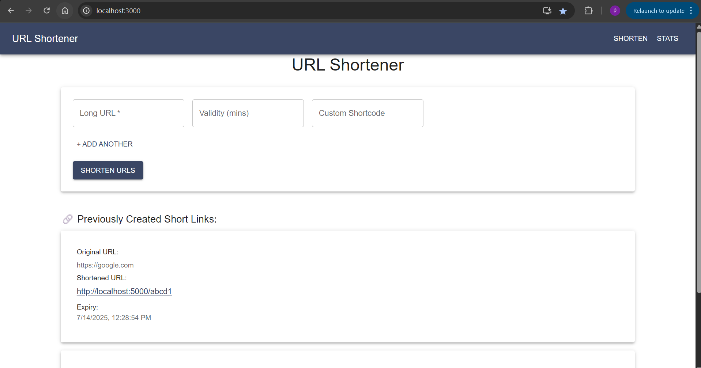
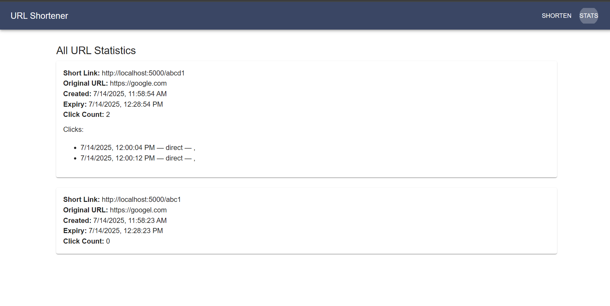

# URL Shortener Microservice and React Frontend - [12203926]

## Project Overview

This project implements a URL shortener microservice with a React frontend, based on the specifications provided in the campus hiring evaluation document. The application allows users to shorten URLs, specify custom shortcodes, and view statistics for shortened links.

**Disclaimer:** This project was developed as part of a campus hiring evaluation and adheres to the guidelines and constraints outlined in the original evaluation document. Certain details have been intentionally omitted or generalized to comply with confidentiality requirements.

## Features
**URL Shortening:** Creates shortened URLs from long URLs.
*   **Custom Shortcodes:** Supports user-specified custom shortcodes (if available and valid).
*   **Statistics Tracking:** Tracks the number of clicks, click timestamps, sources, and geographical locations for each shortened URL.
*   **React Frontend:** Provides a user interface for shortening URLs and viewing statistics.
*   **Material UI:** Utilizes Material UI for styling.


## Setup Instructions

Follow these steps to set up and run the project:

1.  **Clone the repository:**

    ```bash
    git clone [Your Repository URL]
    cd [Your Repository Name]
    ```

2.  **Backend Setup:**

    ```bash
    cd backend
    npm install  # or yarn install
    npm run dev    # or your start command
    ```

3.  **Frontend Setup:**

    ```bash
    cd frontend
    npm install  # or yarn install
    npm start
    ```


## SCREENSHOT


Here's the URL Shortener page:



And here's the Statistics page:



